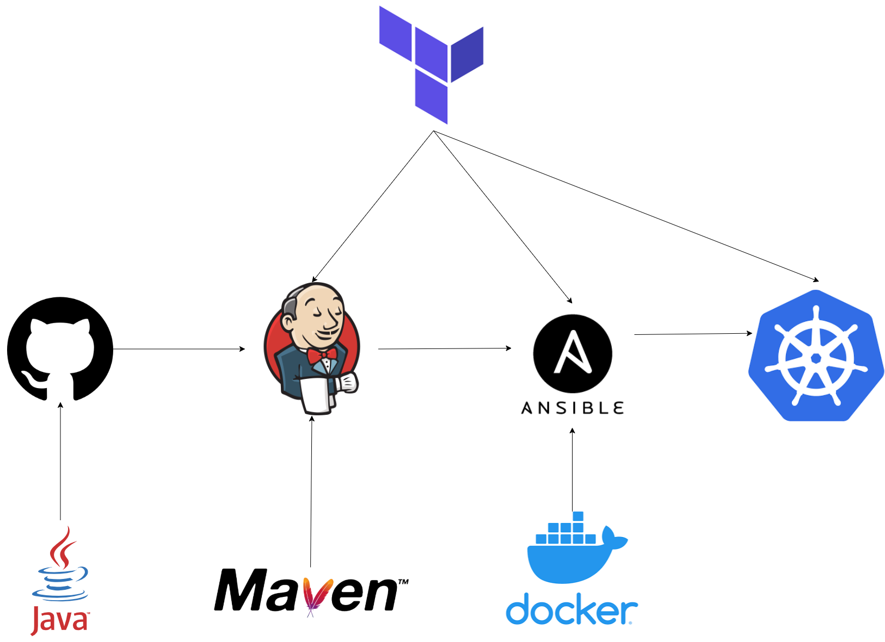

# MyProjectApp - CI/CD Pipeline

This repository contains all the necessary Terraform scripts and manifest files for setting up an end-to-end CI/CD pipeline for MyProjectApp deployment on Kubernetes.

## Architecture Overview

The pipeline integrates various DevOps tools to automate the build, test, and deployment process:

*   **Source Code Management:** GitHub repository hosts the application code
*   **Build Tool:** Maven for building Java applications
*   **CI/CD Server:** Jenkins for continuous integration and deployment
*   **Configuration Management:** Ansible for server configuration and deployment automation
*   **Containerization:** Docker for creating application containers
*   **Container Orchestration:** Kubernetes (EKS) for container deployment and management

## Deployment Process

### 1. Infrastructure Setup

*   **Terraform Server:** Provisions AWS infrastructure using Infrastructure as Code
*   **Jenkins Server:** Manages CI/CD pipelines
*   **Ansible Server:** Handles configuration management and deployment automation
*   **EKS Cluster:** Hosts the containerized application

### 2. CI Pipeline

The Continuous Integration pipeline:

*   Pulls source code from GitHub
*   Builds the application using Maven
*   Runs tests to ensure code quality
*   Creates a Docker image of the application
*   Pushes the Docker image to a registry

### 3. CD Pipeline

The Continuous Deployment pipeline:

*   Deploys the application to the EKS cluster using Kubernetes manifests
*   Manages application updates and rollbacks
*   Ensures high availability and scalability

## Setup Instructions

Detailed setup instructions can be found in the deployment guide within this repository.

## Prerequisites

*   AWS Account with appropriate permissions
*   Knowledge of Terraform, Jenkins, Ansible, Docker, and Kubernetes

## Quick Start

1.  Start a Terraform Server on AWS
2.  Install Terraform and provision infrastructure
3.  Set up Jenkins Server with Maven
4.  Configure Ansible Server with Docker
5.  Provision EKS cluster with eksctl
6.  Set up integration between Jenkins, Ansible, and EKS
7.  Create CI/CD jobs in Jenkins
8.  Deploy the application

#
